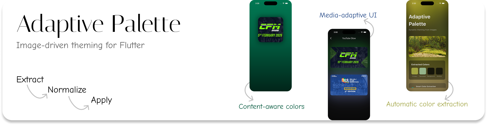

# Adaptive Palette

[](https://pub.dev/packages/adaptive_palette)
[](https://github.com/HardikSJain/adaptive_palette/actions)
[](https://opensource.org/licenses/MIT)
[](https://flutter.dev)



Dynamic theming from images for Flutter. Extract vibrant colors and create accessible Material Design 3 themes with Spotify/Luma-style adaptive backgrounds.

## Features

- **Intelligent color extraction** - Adaptive algorithm that automatically adjusts to different image types (colorful, monochromatic, or normal)
- **Perceptual color science** - Uses CAM16/HCT color space for human-eye-accurate color analysis
- **Material Design 3** - Full M3 theming with tonal palettes and dynamic color
- **Accessible by default** - WCAG contrast validation ensures readable text (4.5:1 minimum)
- **Animated transitions** - Smooth theme changes with `PaletteScope`
- **Performance optimized** - Content-based caching, efficient median-cut quantization
- **Production ready** - Works with all image types: photos, products, landscapes, UI screenshots
- **Flutter 3.0+ compatible** - Supports ~2 years of Flutter releases
- **Hero-ready widgets** - Drop-in overlay/glow/scaffold widgets for Spotify, YouTube, and Luma-style UIs

## Installation

```yaml
dependencies:
  adaptive_palette: ^2.0.2
```

## Examples

Check out the [example](example/) directory for complete, runnable examples:

- **[main.dart](example/lib/main.dart)** - Full-featured app with blurred backgrounds and animated color palette display
- **[simple_example.dart](example/lib/simple_example.dart)** - Minimal implementation showing basic usage

Run the example:
```bash
cd example
flutter run
```

## Quick Start

```dart
import 'package:adaptive_palette/adaptive_palette.dart';

// Extract colors from any ImageProvider
final colors = await AdaptivePalette.fromImage(
  NetworkImage('https://example.com/image.jpg'),
  targetBrightness: Brightness.dark,
);

// colors contains: primary, secondary, background, surface, and their on-colors
```

## Adaptive Palette - Image Overlay Template

Build Spotify/Luma-style overlays without wiring anything yourself. The package now ships with three drop-in widgets:

1. **`AdaptiveImageOverlay`** – hero/playlist cards with adaptive gradients.
2. **`AdaptiveGlowImageFrame`** – YouTube-style border glow pulled from image colors.
3. **`AdaptiveGradientScaffold`** – fills an entire screen background with the image palette.

### AdaptiveImageOverlay

```dart
AdaptiveImageOverlay.network(
  'https://picsum.photos/1600/900',
  overlayStyle: const AdaptiveOverlayStyle(
    begin: Alignment.centerLeft,
    end: Alignment.centerRight,
    stops: [0.0, 0.4, 0.7, 1.0],
    opacities: [0.95, 0.65, 0.25, 0.0],
  ),
  borderRadius: BorderRadius.circular(28),
  padding: const EdgeInsets.all(32),
  child: Column(
    crossAxisAlignment: CrossAxisAlignment.start,
    mainAxisAlignment: MainAxisAlignment.center,
    children: const [
      Text('Gradient Overlay', style: TextStyle(fontSize: 24)),
      SizedBox(height: 12),
      Text('Drop this on any hero image to mirror Spotify/Luma.'),
    ],
  ),
);
```

### AdaptiveGlowImageFrame

```dart
AdaptiveGlowImageFrame.network(
  'https://picsum.photos/2000/1100',
  aspectRatio: 21 / 9,
  blurRadius: 48,
  spreadRadius: 10,
  tone: AdaptiveOverlayTone.secondary,
);
```

### AdaptiveGradientScaffold

```dart
AdaptiveGradientScaffold.network(
  'https://picsum.photos/1800/1200',
  appBar: AppBar(
    title: const Text('Adaptive Palette Overlay Kit'),
    backgroundColor: Colors.transparent,
  ),
  body: ListView(children: const [Text('Your content here')]),
);
```

Wrap your app with `PaletteScope` and the scaffold will automatically drive your Material theme (set `syncWithPaletteScope: false` if you want manual control). Each widget also exposes `onColorsReady` so you can tap into the extracted palette.

`AdaptiveOverlayStyle` powers all three widgets. Use it to change gradient direction, tone (primary/secondary/surface/background), or provide explicit `colors` if you want a custom ramp.

### Gradient Patterns

Left-to-right hero overlay:

```dart
const AdaptiveOverlayStyle(
  begin: Alignment.centerLeft,
  end: Alignment.center,
  stops: [0.0, 0.4, 0.7, 1.0],
  opacities: [0.9, 0.6, 0.3, 0.0],
)
```

Diagonal accent overlay:

```dart
const AdaptiveOverlayStyle(
  begin: Alignment.bottomLeft,
  end: Alignment.topRight,
  stops: [0.0, 0.45, 1.0],
  opacities: [0.95, 0.45, 0.0],
  tone: AdaptiveOverlayTone.secondary,
)
```

> See `example/lib/image_overlay_template.dart` or run `flutter run -t lib/image_overlay_template.dart` inside `example/` to try all three black-box widgets together.

## Usage

### Complete App Example

```dart
import 'package:adaptive_palette/adaptive_palette.dart';
import 'package:flutter/material.dart';
import 'dart:ui' as ui;

void main() => runApp(
  const PaletteScope(
    seed: ThemeColors.fallback(),
    brightness: Brightness.dark,
    child: MyApp(),
  ),
);

class MyApp extends StatelessWidget {
  const MyApp({super.key});

  @override
  Widget build(BuildContext context) => MaterialApp(
    theme: PaletteScope.of(context).theme,
    home: const MyHomePage(),
  );
}

class MyHomePage extends StatefulWidget {
  const MyHomePage({super.key});

  @override
  State<MyHomePage> createState() => _MyHomePageState();
}

class _MyHomePageState extends State<MyHomePage> {
  ThemeColors? _colors;

  @override
  void initState() {
    super.initState();
    _extractColors();
  }

  Future<void> _extractColors() async {
    final colors = await AdaptivePalette.fromImage(
      const NetworkImage('https://picsum.photos/800/600'),
      targetBrightness: Brightness.dark,
    );

    if (!mounted) return;

    setState(() => _colors = colors);

    // Animate to new theme
    PaletteScope.of(context).animateTo(
      colors,
      duration: const Duration(milliseconds: 800),
    );
  }

  @override
  Widget build(BuildContext context) {
    return Scaffold(
      body: Center(
        child: _colors == null
            ? const CircularProgressIndicator()
            : Text(
                'Theme extracted!',
                style: Theme.of(context).textTheme.headlineMedium,
              ),
      ),
    );
  }
}
```

### Creating a Blurred Background (Spotify/Luma Style)

```dart
// Build a blurred adaptive background manually
Stack(
  fit: StackFit.expand,
  children: [
    Transform.scale(
      scale: 1.2,
      child: ImageFiltered(
        imageFilter: ui.ImageFilter.blur(sigmaX: 80, sigmaY: 80),
        child: Image.network(
          'https://example.com/cover.jpg',
          fit: BoxFit.cover,
        ),
      ),
    ),
    Container(
      decoration: BoxDecoration(
        gradient: LinearGradient(
          begin: Alignment.topCenter,
          end: Alignment.bottomCenter,
          colors: [
            Theme.of(context).colorScheme.surface.withOpacity(0.1),
            Theme.of(context).colorScheme.surface.withOpacity(0.3),
          ],
        ),
      ),
    ),
    // Your content here
  ],
)
```

## Demo

Run the included demo to see adaptive theming in action:

```bash
git clone https://github.com/HardikSJain/adaptive_palette.git
cd adaptive_palette
flutter pub get
flutter run
```

The demo shows a Luma-style adaptive background that extracts colors from an image and smoothly transitions the theme.

## API Reference

### AdaptivePalette.fromImage()

Extract a theme color palette from an image.

```dart
Future<ThemeColors> fromImage(
  ImageProvider provider, {
  Brightness targetBrightness = Brightness.light,
  int quantizeColors = 24,        // 8-64, more = better quality, slower
  int resize = 96,                 // 64-256, larger = slower but more accurate
  double minContrast = 4.5,        // WCAG contrast ratio: 4.5=AA, 7.0=AAA
})
```

**Parameters:**
- `provider` - Any Flutter `ImageProvider` (NetworkImage, AssetImage, FileImage, etc.)
- `targetBrightness` - Generate colors for light or dark theme
- `quantizeColors` - Number of colors to extract (higher = better quality, slower)
- `resize` - Downsample image to this size for faster processing
- `minContrast` - Minimum WCAG contrast ratio for text colors

### ThemeColors

Generated theme color palette with accessibility guarantees.

```dart
class ThemeColors {
  final Color primary;         // Main brand color
  final Color onPrimary;       // Text on primary (contrast-safe)
  final Color secondary;       // Accent color
  final Color onSecondary;     // Text on secondary (contrast-safe)
  final Color background;      // Page background
  final Color onBackground;    // Text on background (contrast-safe)
  final Color surface;         // Card/surface color
  final Color onSurface;       // Text on surface (contrast-safe)
}
```

### PaletteScope

Animated theme container for app-wide color transitions.

```dart
PaletteScope({
  required ThemeColors seed,
  required Widget child,
  Brightness brightness = Brightness.light,
})

// Access the controller
final controller = PaletteScope.of(context);

// Get current theme
final theme = controller.theme;

// Animate to new colors
controller.animateTo(
  newColors,
  duration: const Duration(milliseconds: 800),
  curve: Curves.easeOutCubic,
);
```

### AdaptiveOverlayStyle

Generate gradient overlays directly from `ThemeColors`.

```dart
final gradient = colors.overlayGradient(
  style: const AdaptiveOverlayStyle(
    begin: Alignment.bottomLeft,
    end: Alignment.topRight,
    stops: [0.0, 0.5, 1.0],
    opacities: [0.9, 0.45, 0.0],
    tone: AdaptiveOverlayTone.secondary,
  ),
);
```

**Parameters:**
- `begin` / `end` - gradient direction
- `stops` & `opacities` - control color falloff
- `tone` - choose which palette tone powers the overlay (primary/secondary/surface/background)
- `colors` - optional list of explicit colors if you need multi-tone gradients
- `colorOverride` - inject a custom base color while still using the adaptive opacity curve

## How It Works

1. **Image processing** - Downsamples image for performance
2. **Median-cut quantization** - Extracts dominant colors using histogram-based algorithm
3. **Perceptual scoring** - Ranks colors by saturation, luminance, and population
4. **HCT color space** - Uses Material Design 3's perceptual color system (Hue-Chroma-Tone)
5. **WCAG validation** - Ensures all text colors meet accessibility standards
6. **SHA-1 caching** - Content-based cache prevents re-processing identical images

## Performance Tips

### Fast extraction (for scrolling lists)

```dart
final colors = await AdaptivePalette.fromImage(
  image,
  resize: 64,           // Smaller = faster
  quantizeColors: 24,   // Fewer colors = faster
);
```

### High quality (for hero/detail views)

```dart
final colors = await AdaptivePalette.fromImage(
  image,
  resize: 256,          // Larger = more accurate
  quantizeColors: 64,   // More colors = better selection
);
```

### Preload palettes

```dart
// Extract colors during app initialization
await Future.wait(
  images.map((img) => AdaptivePalette.fromImage(img)),
);
// Results are cached for instant access later
```

## Requirements

- Flutter SDK: >=3.0.0
- Dart SDK: >=3.0.0 <4.0.0

## Dependencies

- `material_color_utilities` - Material Design 3 color science
- `crypto` - SHA-1 hashing for content-based caching
- `cached_network_image` - Efficient network image loading
- `path_provider` - Cache directory access
